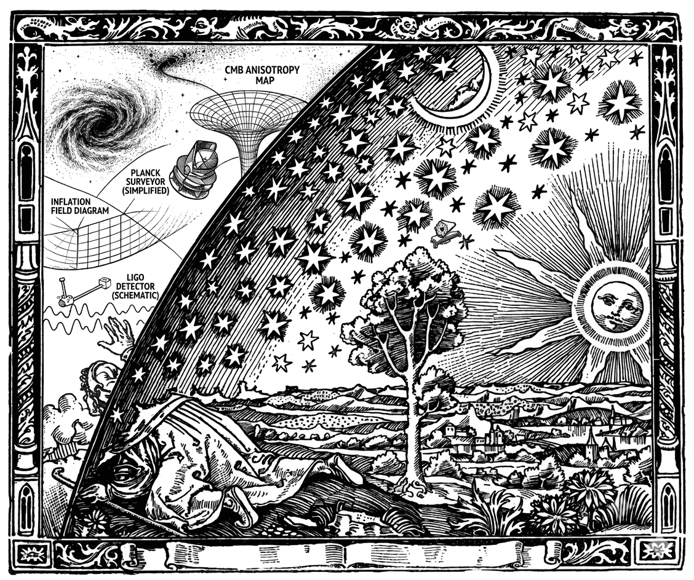

# Нотатки: від інфлатона до CMB



Навчальний конспект з космології для фізика, знайомого із загальною теорією відносності.
Будує послідовний ланцюжок від рівнянь Фрідмана до кутового спектра реліктового випромінювання та сучасних проблем космології.

**Автор:** Пономаренко С. М.

---

## Структура проекту

```
├── chapters/                        # Розділи конспекту
│   ├── tikz/
│   │   └── fig_newton_sphere.tikz   # TikZ-діаграма ньютонівської кулі
│   ├── 01_friedmann.tex             # Фонова космологія: метрика FLRW, рівняння Фрідмана, ΛCDM
│   ├── 02_inflaton.tex              # Інфлатон і його потенціал, slow-roll
│   ├── 03_metric_perturbations.tex  # SVT-розклад збурень метрики, калібрування
│   ├── 04_quantum_fluctuations.tex  # Квантові флуктуації, спектр Муханова-Сасакі
│   ├── 05_reheating.tex             # Розігрів: параметричний резонанс, термалізація
│   ├── 06_plasma_acoustics.tex      # Гідродинаміка фотон-баріонної плазми, BAO
│   ├── 07_sachs_wolfe.tex           # Ефект Закса-Вольфа, кутовий спектр CMB
│   ├── 08_cmb_polarisation.tex      # Поляризація CMB, E- і B-моди
│   ├── 09_chaotic_inflation.tex     # Хаотична інфляція Лінде, вічна інфляція
│   ├── 10_future_research.tex       # Перспективи: JWST, зламаний спектр, MCMC
│   ├── 11_software.tex              # Огляд Python-пакетів (CAMB, CLASS, Cobaya)
│   ├── 12_practical_guide.tex       # Практичний посібник: від даних CMB до параметрів моделі
│   ├── app_a_data.tex               # Додаток А: сучасні космологічні параметри ΛCDM
│   ├── app_b_efolds.tex             # Додаток Б: вивід тривалості інфляції та вікна CMB
│   └── appendix_newton_energy.tex   # Додаток В: ньютонівська космологія і збереження енергії
│
├── data/                            # Спостережні дані для графіків
│   ├── LCDM.txt                     # Теоретичний спектр ΛCDM (CAMB, Planck 2018 best-fit)
│   └── plankdata.txt                # Збіновані дані TT Planck 2018 з похибками
│
├── fonts/                           # Шрифти Bookman Old Style
│
├── pictures/                        # Зображення
│   ├── planck_cmb_map.png           # Карта CMB Planck 2018
│   ├── Inflaton.png                 # Схема потенціалу інфлатона
│   ├── lindebigbangplot.png         # Діаграма хаотичної інфляції Лінде
│   ├── H0.png                       # Ілюстрація напруги Хаббла
│   ├── Flammarion.jpg               # Гравюра Фламмаріона
│   └── Modern_flagmarion.png        # Сучасна версія гравюри
│
├── references/
│   └── references.bib               # Бібліографія (BibTeX)
│
├── scripts/
│   └── Universe.py                  # Python-скрипт для генерації графіків спектрів
│
├── cosmology_summary.tex            # Головний файл (підключає всі розділи)
└── cosmology_summary.pdf            # Скомпільований PDF
```

---

## Зміст

**Частина I. Фон**
- §1. Фонова космологія: від метрики FLRW до ΛCDM
- §2. Інфлатон і його потенціал

**Частина II. Збурення**
- §3. Збурення метрики: SVT-розклад і калібрування
- §4. Квантові флуктуації і збурення

**Частина III. Спостереження**
- §5. Розігрів і народження матерії
- §6. Гідродинаміка фотон-баріонної плазми та акустичні осциляції
- §7. Ефект Закса-Вольфа та формування кутового спектра CMB
- §8. Поляризація CMB
- §9. Хаотична інфляція Лінде

**Частина IV. Невирішені проблеми**
- §10. Перспективи: зламаний спектр і JWST

**Частина V. Чисельні методи**
- §11. Python-пакети для космологічних досліджень
- §12. Практичний посібник: від даних CMB до параметрів моделі

**Додатки**
- А. Сучасні космологічні параметри ΛCDM
- Б. Вивід тривалості інфляції та вікна спостережень CMB
- В. Ньютонівська космологія і закон збереження енергії

---

## Компіляція

Проект використовує **LuaLaTeX** і шрифти Bookman Old Style.

```bash
lualatex cosmology_summary.tex
biber cosmology_summary
lualatex cosmology_summary.tex
lualatex cosmology_summary.tex
```

Або через latexmk:

```bash
latexmk -lualatex cosmology_summary.tex
```

---

## Залежності

- LuaLaTeX (TeX Live 2023+)
- Пакети: `fontspec`, `tikz`, `pgfplots`, `amsmath`, `tcolorbox`, `biblatex`
- Python 3.x з пакетами `camb`, `numpy`, `matplotlib` (для `scripts/Universe.py`)

---

## Дані

`data/plankdata.txt` — збіновані дані TT Planck 2018
(`COM_PowerSpect_CMB-TT-binned_R3.01.txt`, колонки: `ell`, `Dl`, `errm`, `errp`).

`data/LCDM.txt` — теоретичний спектр $\mathcal{D}_\ell^{TT}$, розрахований через CAMB
з параметрами Planck 2018 best-fit.
